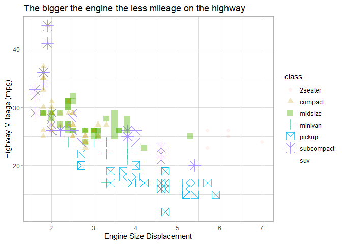
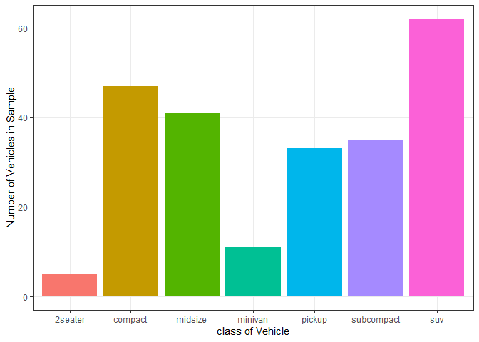
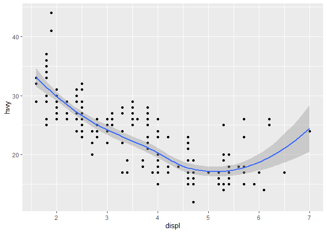

# Visualize Data
Audrey Longan

<!-- If you get the error "Error in list2(na.rm = na.rm, ...) : object 'ffi_list2' not found" do the following in the Console run:  
&#10;    remove.packages("rlang")
&#10;Then Restart R to be safe. Then run:
&#10;    install.packages("rlang")
&#10;and again restart R to be safe. That should fix the problem (which is a package dependency issue).   -->

Try your code again

## Your Turn 0

Add a setup chunk that loads the tidyverse packages.

``` r
head(mpg)
```

    # A tibble: 6 × 11
      manufacturer model displ  year   cyl trans      drv     cty   hwy fl    class 
      <chr>        <chr> <dbl> <int> <int> <chr>      <chr> <int> <int> <chr> <chr> 
    1 audi         a4      1.8  1999     4 auto(l5)   f        18    29 p     compa…
    2 audi         a4      1.8  1999     4 manual(m5) f        21    29 p     compa…
    3 audi         a4      2    2008     4 manual(m6) f        20    31 p     compa…
    4 audi         a4      2    2008     4 auto(av)   f        21    30 p     compa…
    5 audi         a4      2.8  1999     6 auto(l5)   f        16    26 p     compa…
    6 audi         a4      2.8  1999     6 manual(m5) f        18    26 p     compa…

## Your Turn 1

Run the code on the slide to make a graph. Pay strict attention to
spelling, capitalization, and parentheses!

``` r
#add code
ggplot(mpg) +
  geom_point(aes(x = displ, y = hwy))
```


## Your Turn 2

Replace this scatterplot with one that draws boxplots. Use the
cheatsheet. Try your best guess.

``` r
ggplot(data = mpg) +
  geom_boxplot(mapping = aes(x = class, y = hwy))
```


## Your Turn 3

Make a histogram of the `hwy` variable from `mpg`. Hint: do not supply a
y variable.

``` r
ggplot(mpg) +
  geom_histogram(aes(x = hwy))
```

    `stat_bin()` using `bins = 30`. Pick better value `binwidth`.


## Your Turn 4

Use the help page for `geom_histogram` to make the bins 2 units wide.

``` r
ggplot(mpg) +
  geom_histogram(aes(x = hwy), binwidth = 2)
```


## Your Turn 5

Add `color`, `size`, `alpha`, and `shape` aesthetics to your graph.
Experiment.

``` r
ggplot(data = mpg) +
  geom_point(mapping = aes(x = displ, 
                           y = hwy,
                           color = class,
                           shape = class,
                           alpha = class,
                           size = class)) +
  labs(x = "Engine Size Displacement",
       y = "Highway Mileage (mpg)",
       title = "The bigger the engine the less mileage on the highway") +
  theme_light()
```

    Warning: Using alpha for a discrete variable is not advised.

    Warning: Using size for a discrete variable is not advised.

    Warning: The shape palette can deal with a maximum of 6 discrete values because more
    than 6 becomes difficult to discriminate
    ℹ you have requested 7 values. Consider specifying shapes manually if you need
      that many of them.

    Warning: Removed 62 rows containing missing values or values outside the scale range
    (`geom_point()`).



## Help Me

What do `facet_grid()` and `facet_wrap()` do? (run the code, interpret,
convince your group)

``` r
# Makes a plot that the commands below will modify
q <- ggplot(mpg) + geom_point(aes(x = displ, y = hwy))

q + facet_grid(. ~ cyl) #makes one row, 4 columns by cyl
```


``` r
q + facet_grid(drv ~ .) #makes 3 rows, one column by drv
```


``` r
q + facet_grid(drv ~ cyl) #makes 3 rows by drv, 4 columns by cyl
```


``` r
q + facet_wrap(~ class) #makes a graph for each value in the class
```


Facet grid makes a grid of graphs that relate to each other by
specifying the variables that you want faceted, while facet wrap makes a
grid of graphs based on a variable by stacking them until there is no
more space, instead of making specific columns and rows.

## Your Turn 6

Make a bar chart `class` colored by `class`. Use the help page for
`geom_bar` to choose a “color” aesthetic for class.

``` r
ggplot(mpg) +
  geom_bar(aes(x=class, fill = class)) +
  guides(fill = "none") +
  labs(x = "class of Vehicle",
       y = "Number of Vehicles in Sample") +
  theme_bw()
```



## Quiz

What will this code do?

``` r
ggplot(mpg, aes(x = displ, y = hwy)) + 
  geom_point() +
  geom_smooth() 
```

    `geom_smooth()` using method = 'loess' and formula = 'y ~ x'



``` r
ggsave("example.jpg")
```

    Saving 7 x 5 in image
    `geom_smooth()` using method = 'loess' and formula = 'y ~ x'

This code will create a graphic with points and a best fit line of mpg
data with displ on the x axis and hwy on the y axis. It adds two
geometries to one plot.

------------------------------------------------------------------------

# Take aways

You can use this starter code template to make thousands of graphs with
**ggplot2**.

``` r
ggplot(data = <DATA>) +
  <GEOM_FUNCTION>(mapping = aes(<MAPPINGS>))
```
